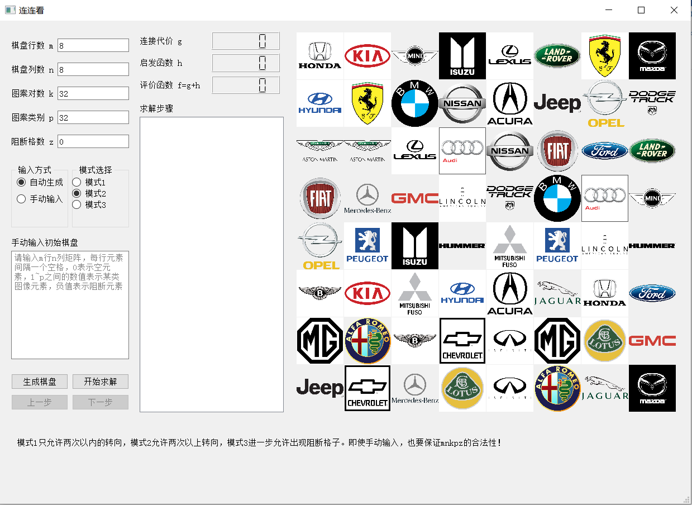

# 连连看、表情识别

人工智能 课程项目 (2021秋)，清华大学自动化系

任课教师: [江瑞](https://scholar.google.com/citations?user=LkF_AbYAAAAJ&hl=en-US)

## [项目1 连连看](./MahjongConnect/)

一个具有图形界面的连连看游戏自主求解器，可以尽可能多地消除图案

下载[llkui.exe](https://cloud.tsinghua.edu.cn/f/22e7dd3eb14549ecb8ed/)并放在MahjongConnect文件夹中，双击运行

## [项目2 表情识别](./FacialExpression/)

**文件列表：**

| Dir   | FileName                            | Description (PT指预训练)         |
| ----- | ----------------------------------- | -------------------------------- |
| code  | LeNet.ipynb                         | 原始数据，LeNet（问题1）         |
|       | vgg9.ipynb                          | 原始数据，VGG-9（问题1）         |
|       | ResNet-11.ipynb                     | 原始数据，ResNet-11（问题1）     |
|       | vgg9-DataEnhance.ipynb              | 增强数据，VGG-9（问题2）         |
|       | vgg11aug_balance_pretrain.ipynb     | 增强数据，PT VGG-11              |
|       | ResNet18aug_balance_pretrain.ipynb  | 增强数据，PT ResNet-18           |
|       | ResNet18aug_balance_pretrain2.ipynb | 增强数据，PT ResNet-18           |
|       | TestTime.ipynb                      | 测试各模型预测模式的运行速度     |
|       | myui.ui                             | 图形界面的QT文件                 |
|       | myui.py                             | 可运行的最终程序（问题3）        |
| model | vgg9net.pkl                         | 原始数据，VGG-9模型，Acc58.4%    |
|       | vgg9net_DataEnhance.pkl             | 增强数据，VGG-9模型，Acc58.8%    |
|       | finetune_vgg11net.pkl               | 增强数据，PT VGG-11，Acc62.1%    |
|       | finetune_resnet18.pkl               | 增强数据，PT ResNet-18，Acc59.1% |
| data  | data.csv  ;  *.pt                   | 原数据；处理后的tensor文件       |
| media | 略                                  | 用于测试GUI程序的图片/视频       |

**使用方法：**

- 先进行**模型训练测试**，有两种方法：

1. 下载整个data文件夹，运行code文件夹中的.ipynb的代码，此时直接从data文件夹读取数据；

2. 将.ipynb代码中读取数据时的readtensor参数改为False，只将data.csv放在data文件夹中，无需下载.pt文件，此时从data.csv重新进行数据前处理（运算较耗时）；

- 再进行**数据预测测试**，使用GUI程序(问题3)：

1. 在python环境中安装下列包：pyqt5, opencv-python, torch, torchvision

2. 将训好的vgg9net.pkl并在model文件夹中，然后运行code文件夹中的 myui.py

[下载数据](https://cloud.tsinghua.edu.cn/f/037773e21aae4859be45/)

